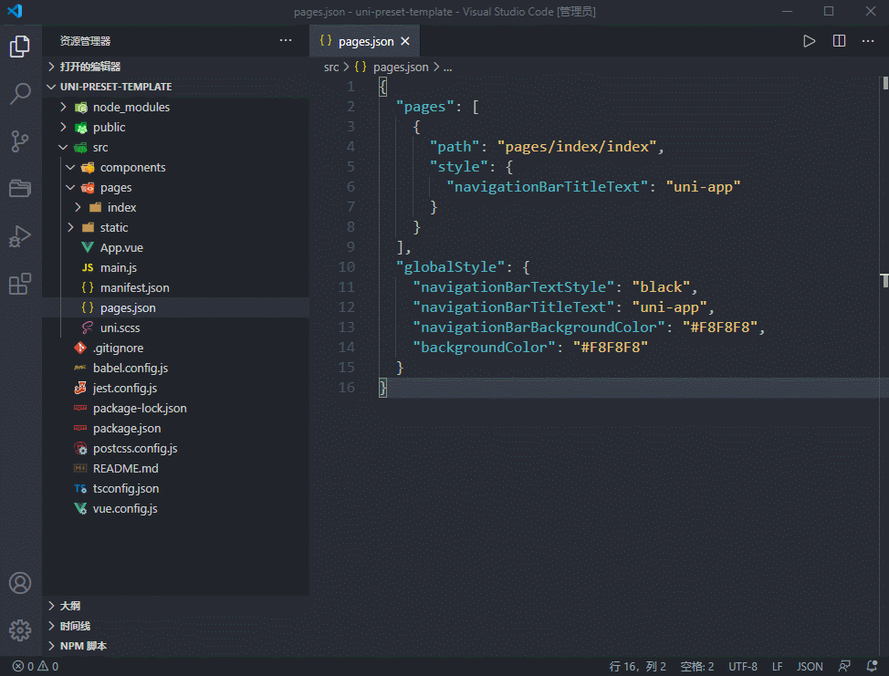

 

<h1 align="center">UniApp Create View for VS Code</h1>

在 VS Code 右键目录文件夹快速创建页面与组建，创建视图页面时将自动添加 `pages.json` 中！

- [Plugin's page on Visual Studio Marketplace](https://github.com/TuiMao233/uni-composition-api)
- [Plugin's page on Github Page](https://github.com/uni-helper/uni-create-view)
- [Plugin's author - Hairy's Blog](https://www.hairy.blog/)

## Features

- 📁 创建页面、分包页面，自动查找根目录下 `pages.json` 文件并写入
- 📦 可深度目录创建，写入 `pages.json` 后仍可保留注释
- ✨ 可配置 `vue(2|3)|composition-api|setup` 组件、页面模板
- 👕 可配置 `scss|less|stylus|sass` 预编辑器类型
- 🦾 `typescript` 为默认开发语言（可在设置中关闭）

<!-- 与是否开启 `typescript` 模板，以及是否为单文件模式 -->

> 使用 `composition-api(vue2)` 模版，建议配合 [uni-composition-api](https://github.com/TuiMao233/uni-composition-api) 使用

## 基本使用（page、component）

右键打开菜单选择创建类型：

## 深度目录

`^1.3.0` 新增扩展能力，无特殊需求还是建议使用单文件模式。

## 分包页面

`^1.3.0` 新增功能，用于创建分包页面，并自动添加至 `subPackages` 字段中。

> 注意：`cli` 创建的项目需要在`package.json`中添加参数 `--minimize`，具体参考官方文档：[dcloud.io](https://uniapp.dcloud.io/collocation/pages?id=subpackages)

## License

[MIT](./LICENSE) License &copy; 2021-PRESENT [Hairyf](https://github.com/hairyf)