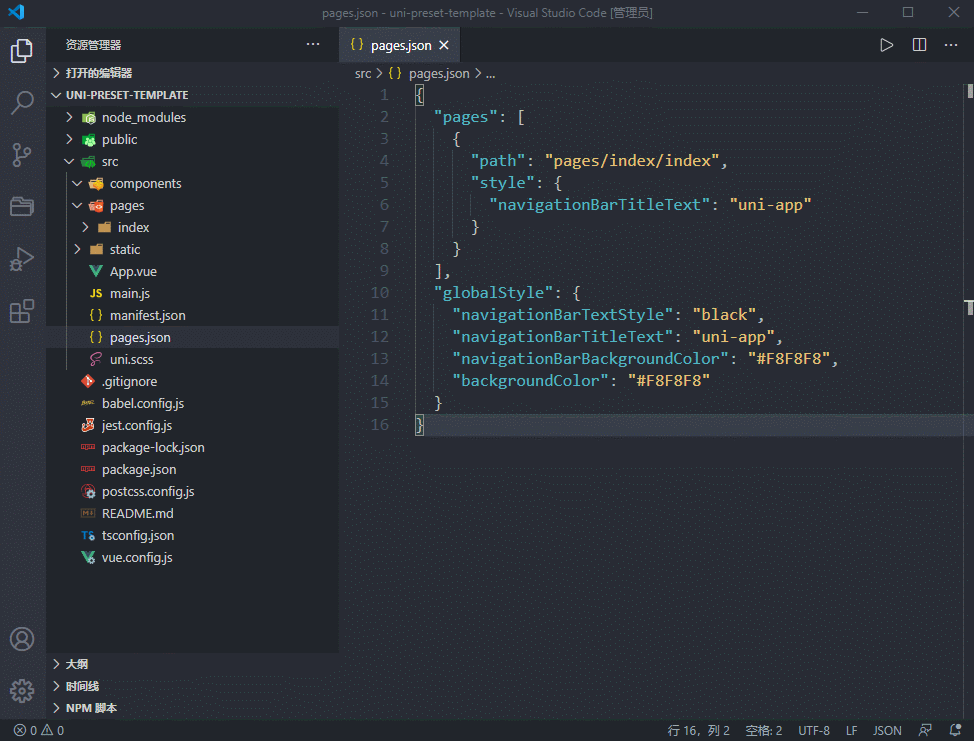
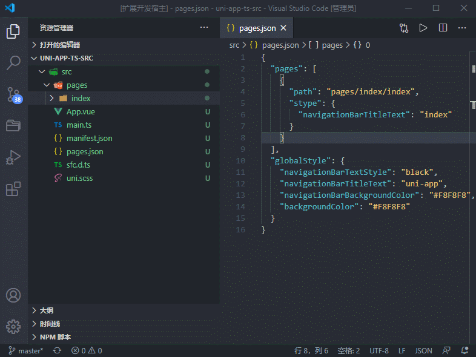
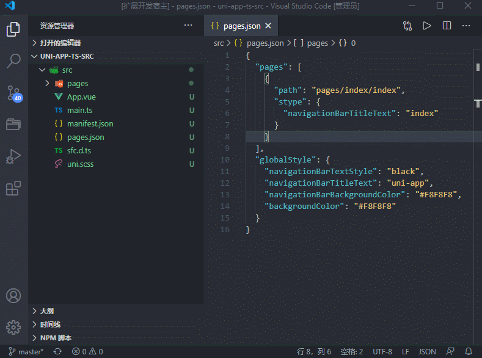

# create-uniapp-view

  

  
  
  
  

  
  

在 VS Code 右键目录文件夹快速创建页面与组件，创建视图页面时将自动写入 `pages.json`！

[改动日志](https://github.com/uni-helper/uni-create-view/blob/main/CHANGELOG.md)

想让 `uni-app` 开发变得更直观、高效？想要更好的 `uni-app` 开发体验？不妨看看 [uni-helper 主页](https://uni-helper.js.org) 和 [uni-helper GitHub Organization](https://github.com/uni-helper)！

## 插件特性

- 📁 创建页面、分包页面，自动向上查找 `pages.json` 并写入
- 📦 可深度目录创建，写入 `pages.json` 后仍可保留注释
- ✨ 可配置 `vue2 | vue3 | composition-api(vue2)` 模板，`vue3` 支持 `<script setup>`
- 👕 可配置 `css | scss | less | stylus | sass` 预处理器类型
- 🦾 `typescript` 为默认开发语言（可在设置中关闭）

> 使用 `composition-api(vue2)` 模板，建议配合 [uni-composition-api](https://github.com/hairyf/uni-composition-api) 使用

## 使用

从 [Visual Studio Marketplace](https://marketplace.visualstudio.com/items?itemName=mrmaoddxxaa.create-uniapp-view) 或 [OpenVSX](https://open-vsx.org/extension/mrmaoddxxaa/create-uniapp-view) 安装插件，重启 VSCode 即可。

### 基本使用（page、component）

右键文件夹打开菜单选择创建类型，可选择创建组件、页面、分包页面，空格分隔视图名称与页面名称（`navigationBarTitleText`）。

### 深度目录

`^1.3.0` 新增扩展能力，无特殊需求还是建议使用单文件模式。

### 分包页面

`^1.3.0` 新增功能，用于创建分包页面，并自动添加至 `subPackages` 字段中。

> 注意：`cli` 创建的项目若遇 vendor.js 过大，可以在 `package.json` 中添加参数 `--minimize`，具体参考官方文档：[dcloud.io](https://uniapp.dcloud.io/collocation/pages?id=subpackages)

## 扩展设置

所有设置项都在 `create-uniapp-view.` 命名空间下，可在 VSCode 设置中修改，默认值与 `package.json` 中声明一致。

| 设置项 | 默认值 | 说明 |
| --- | --- | --- |
| `create-uniapp-view.typescript` | `true` | 创建视图时是否选择 TypeScript 为默认语言 |
| `create-uniapp-view.directory` | `false` | 创建视图时是否创建同名文件夹 |
| `create-uniapp-view.name` | `index` | 创建文件夹中生成的文件名，可选 `index` 或 `与文件夹同名` |
| `create-uniapp-view.style` | `css` | 创建视图时 CSS 预处理器的类型，可选 `css`、`scss`、`less`、`stylus`、`sass` |
| `create-uniapp-view.scoped` | `true` | 创建模板时，是否使用 `<style scoped>` |
| `create-uniapp-view.setup` | `true` | 创建 vue3 模板时，是否使用 `<script setup>` |
| `create-uniapp-view.template` | `vue3` | 选择创建的模板，可选 `vue2`、`vue3`、`composition-api(vue2)` |

## 命令

| 命令 | 标题 |
| --- | --- |
| `create-uniapp-view.createPage` | 新建uniapp页面 |
| `create-uniapp-view.createSubcontractPage` | 新建uniapp页面(分包) |
| `create-uniapp-view.createComponent` | 新建uniapp组件 |

三个命令都注册在资源管理器右键菜单中，仅在文件夹上显示；从命令面板调用时会提示先在资源管理器中右键目标文件夹。

## 参与贡献

欢迎通过 Issue 或 Pull Request 参与改进本项目。开始前请阅读 [CONTRIBUTING.md](./CONTRIBUTING.md)，了解项目结构、本地开发流程、测试方式与提交规范。

## 许可证

[MIT](https://github.com/uni-helper/uni-create-view/blob/main/LICENSE) © 2021-PRESENT [Hairyf](https://github.com/hairyf) & Collaborators
